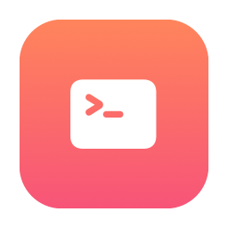
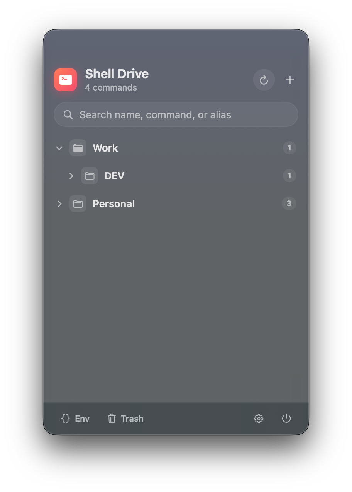
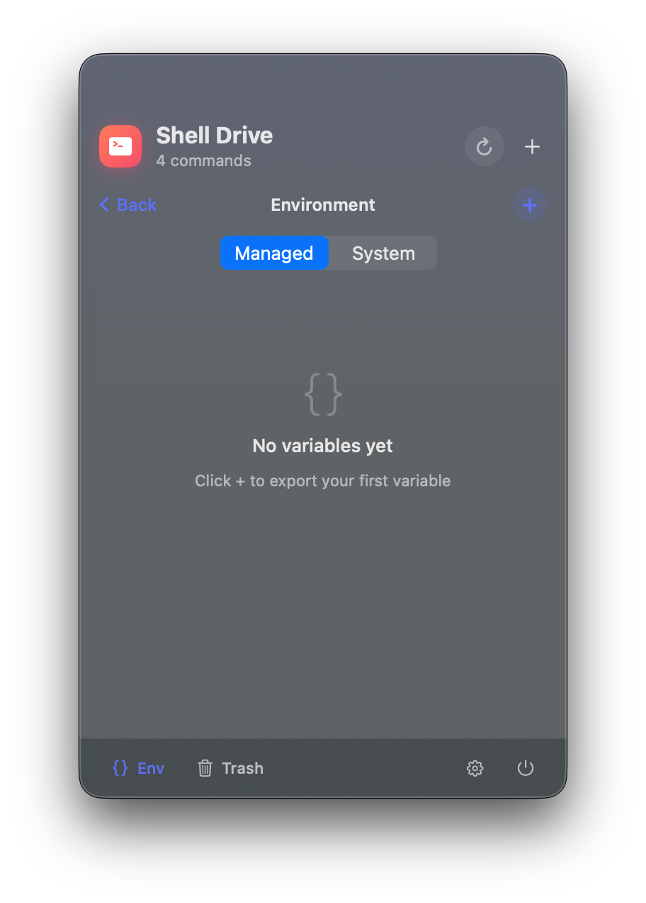

<div align="center">
  
  <h1>Shell Drive</h1>
  <p>A native macOS menu-bar app for storing shell &amp; SSH commands — click to paste, run, or alias them.</p>
</div>

---

Shell Drive lives in your menu bar as a lightweight utility. Keep your commands
organized in folders, then click one to **paste it into your terminal**, **run
it**, or turn it into a **shell alias** — no more digging through history.

<div align="center">
  
  &nbsp;&nbsp;
  
</div>

## Features

- 🗂️ **Organize** commands in nested folders, with drag-and-drop to move and reorder.
- 📋 **Paste to terminal** — click a command to copy it and paste it into your last-used terminal.
- ▶️ **Run in shell** — execute a command in your terminal (with a confirmation prompt).
- 🔗 **Aliases** — give a command a slug and Shell Drive writes it to `~/.zshrc`, so you can run it from anywhere.
- `{}` **Environment variables** — export **Managed** variables that Shell Drive writes to `~/.zshrc` as `export KEY=value`, and browse the read-only **System** environment your login shell actually sees.
- 🔎 **Search** by name, command, or alias.
- 🗑️ **Recycle bin** — deletes are recoverable; restore or empty anytime.
- 🖥️ **Pick your terminal** — Terminal, iTerm, Warp, Ghostty, kitty, WezTerm, Alacritty, Hyper.
- 🚀 **Launch at login**, no Dock icon — just the menu bar.

## Install

Download the latest `Shell Drive.dmg` from [Releases](../../releases), open it,
and drag **Shell Drive** into Applications.

> The app is ad-hoc signed (no paid Apple Developer ID), so on first launch use
> **right-click → Open** to get past Gatekeeper.

## Build from source

No Xcode IDE required — just the Command Line Tools (`xcode-select --install`).

```bash
./build.sh        # builds "Shell Drive.app"
./make-dmg.sh     # builds the app and packages a shareable .dmg
```

## Usage

- **Add** — the `+` in the header, or right-click a folder.
- **Paste** — click a command (copies it and pastes into your terminal).
- **Run** — the ▶ action or right-click → *Run in Shell…* (asks to confirm).
- **Alias** — set an alias in the editor; open a new terminal (or `source ~/.zshrc`) to use it.
- **Env** — the `{}` in the footer: on the *Managed* tab, click `+` to export a variable; switch to *System* to inspect the variables your login shell already has. New/changed managed variables apply in the next terminal (or after `source ~/.zshrc`).
- **Organize** — drag rows onto folders to move, or onto a command to reorder.
- **Settings** — the gear in the footer: default terminal, launch at login, data folder.

## Permissions

- **Accessibility** — required to synthesize ⌘V for *Paste* and *Run* in
  non-scriptable terminals. macOS prompts on first use.
- **Automation** — *Run* in Terminal/iTerm uses AppleScript; macOS asks to allow
  controlling that app once.

Copy-to-clipboard needs no permissions.

## Data

Your commands are stored as JSON outside the app bundle, so they survive updates
and uninstalls:

```
~/Library/Application Support/ShellDrive/drive.json
```

Aliases and managed environment variables are written to their own managed
blocks in `~/.zshrc` (backed up once to `~/.zshrc.shelldrive.bak` before the
first edit).

## Project structure

```
Sources/
├── App/        Entry point, menu-bar + panel controller, app constants
├── Models/     DriveNode, DriveStore (persistence), sample data
├── Services/   Terminal paste/run, alias sync, login item, terminal catalog
├── Design/     Theme, vibrancy view, shared card styles
└── Views/      RootView, command rows, editor, settings, trash, dialogs
```

## License

[MIT](LICENSE)
